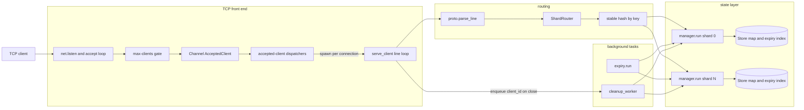
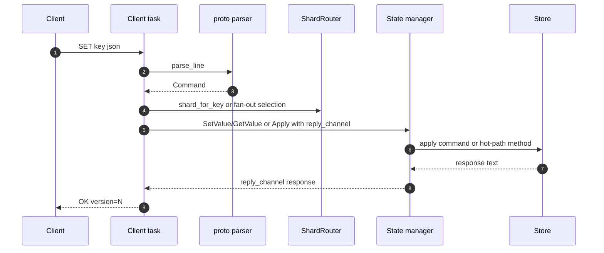
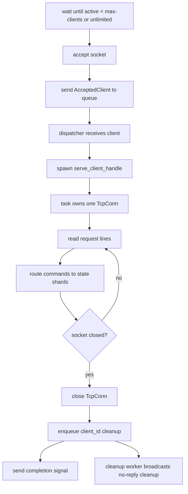
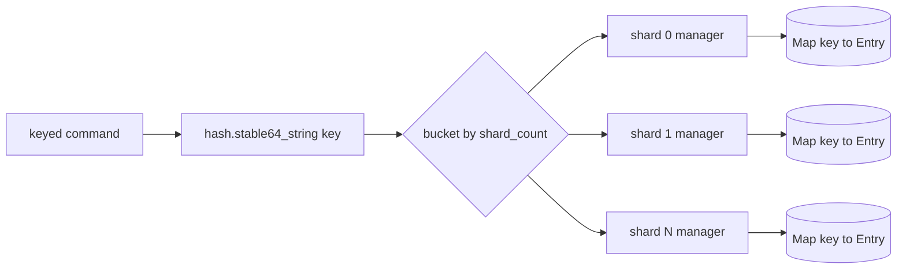
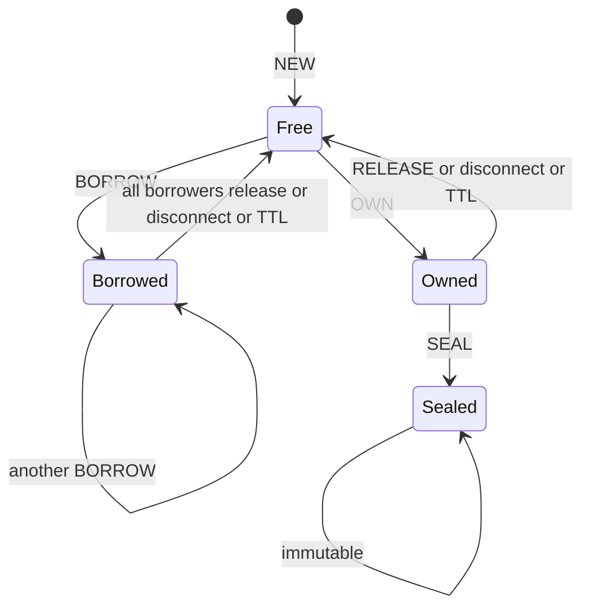
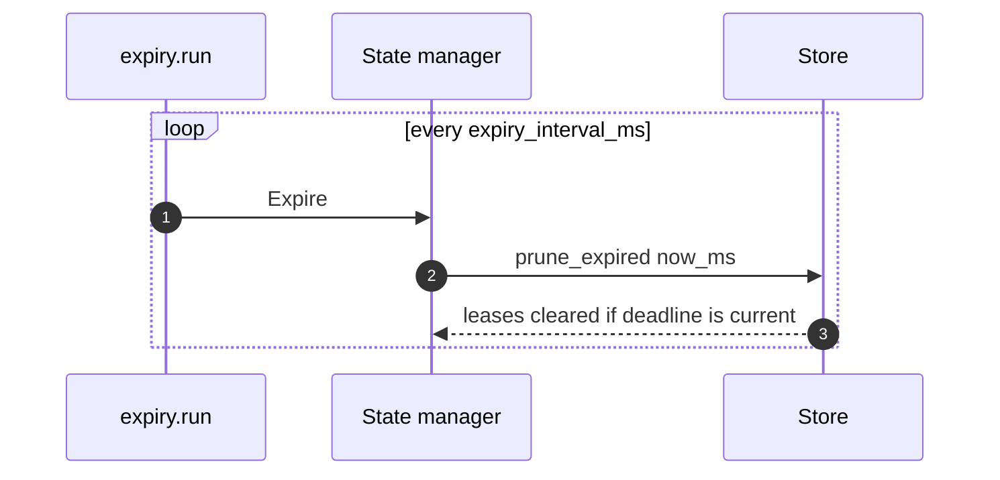

# surgekv Architecture

This document describes the current implementation, not only the intended
design. It is meant to keep the server model clear before we start heavier
load, memory, and deadlock checks.

## Short Answer: Clients and Workers

Multiple clients can connect to one `surgekv` instance.

`--workers` is the accepted-client dispatcher count. Dispatchers receive
accepted sockets from the queue and spawn a dedicated `serve_client` task for
each connection. A long-lived idle TCP session therefore does not occupy the
dispatcher, and a single server instance can serve multiple active clients even
with `--workers 1`.

State is sharded separately with `--shards`; dispatcher workers, client
connection tasks, and state shards are different layers.

`--max-clients` caps accepted active clients when set above zero. `0` means
unlimited. When the cap is reached, the accept loop waits for a completion signal
from an existing client task before accepting another socket. Connections beyond
that cap wait in the OS backlog; the server does not yet send a protocol-level
rejection.

## Component Map



## Code Map

| Area | Files | Responsibility |
| --- | --- | --- |
| Entrypoint and config | `main.sg`, `config/*` | Parse CLI flags and start `server.serve`. |
| TCP server | `server/serve.sg`, `server/line.sg`, `server/ids.sg` | Accept sockets, assign client ids, read request lines, write response lines. |
| Routing | `server/shards.sg` | Hold state-manager request channels, pick keyed shards, and support fan-out helpers. |
| Protocol | `proto/*` | Parse text commands and format text responses. |
| State managers | `manager/*` | Own shard request channels and run one task per state shard. |
| KV state | `state/*` | Store entries, ownership, borrows, versions, seal state, and expiry index. |
| Background workers | `server/serve.sg`, `expiry/run.sg` | Queue disconnect cleanup and periodically ask state managers to prune expired leases. |

## Request Flow



Every command is executed as a text request and text response. The state manager
does not expose shared mutable state to the TCP layer; it receives messages
through a channel. Key-scoped socket commands reuse one reply channel per client
task; aggregate/global paths still allocate short-lived reply channels.

## Connection Model



Operational consequences:

- Active long-lived clients are not bounded by `--workers`.
- `--workers` controls how many dispatcher tasks drain the accepted-client
  queue.
- `--client-queue` buffers accepted sockets before a dispatcher spawns their
  client tasks.
- `--max-clients N` limits accepted active clients for `N > 0`; `0` disables
  the cap.
- Workers keep handles to spawned client tasks and cancel/await them during
  server shutdown.
- Completed clients send a lightweight completion message to the accept loop so
  the max-client slot can be reused.
- On disconnect, the client task closes the socket and enqueues one cleanup
  item. A cleanup worker fans out no-reply cleanup messages to the shards, so
  short-lived connection churn no longer waits for every shard reply in the
  socket task.

## State Sharding Model



Each state manager owns one `Store`:

```text
Store {
    entries: Map<string, Entry>,
    expiry_index: ExpiryRecord[],
    test_now_ms: int64?,
}
```

The shard manager is the only task that mutates its `Store`. This gives us a
simple actor-style concurrency model:

- Commands for the same shard are serialized.
- Commands for different shards can progress independently.
- A single key is always handled by one shard because routing is based on the
  stable hash of the key.

Global commands are handled specially:

- `WHOAMI` asks all shards for hold counts and sums them.
- `KEYS` asks all shards for matching keys, merges, and sorts the result.
- `DISCONNECT` broadcasts to all shards so every owned or borrowed key held by
  that client is released.

## Entry State



`Entry` stores:

- raw JSON text as `value`
- optional exclusive `owner`
- zero or more `borrowers`
- permanent `sealed` flag
- lease TTL and monotonic deadline
- monotonic `version`, starting at `1`

Write rules:

- Free keys accept `SET`, `SET ... IF`, and `DEL`.
- The current owner can write an owned key.
- Any other writer receives `LOCKED`.
- Borrowed keys reject writes with `LOCKED`.
- Sealed keys reject mutation with `SEALED`.

## Expiry Model



TTL renewals append a new `ExpiryRecord`. Old records can remain in
`expiry_index` briefly. During pruning, a record only clears a lease when its
deadline still matches the entry's current `lease_deadline_ms`; stale records
are dropped.

This avoids scanning every key on every tick. The cost is proportional to the
number of pending expiry records in the shard.

## Bottlenecks and Guarantees

| Layer | Current behavior | Notes |
| --- | --- | --- |
| TCP accept | One accept loop | Accepts sockets and enqueues `AcceptedClient`. |
| Client limit | Optional `--max-clients` gate | Caps accepted active clients; excess waits in OS backlog. |
| Client serving | One task per active socket | Long-lived clients do not occupy dispatchers. |
| State mutation | One manager task per shard | Intentional serialization point. |
| Same key writes | Serialized by one shard | Required for ownership and version correctness. |
| Different key writes | Parallel across shards | Depends on key distribution and shard count. |
| Expiry | One periodic background task | Sends non-blocking expire messages to shards. |
| Disconnect cleanup | Queued worker broadcasts no-reply cleanup to all shards, then each shard scans its store | Correct and no longer on the socket hot path; reverse index can reduce scan cost later. |
| Runtime networking | Surge stdlib/runtime path | Bulk socket I/O is verified; remaining benchmark work is throughput and tail-latency profiling. |

## Next Hardening Work

The latest benchmark pass keeps the state architecture intact. Disconnect
cleanup is off client socket tasks, key-scoped commands avoid per-request reply
channel allocation, and the upstream runtime/network regressions are fixed
locally.

Current evidence:

1. Default `SURGE_THREADS`, `SURGE_THREADS=1`, and `SURGE_THREADS=8` complete
   the current 32-client `GET`/`SET`/`mixed` reports with zero errors.
2. Clean LLVM output for `surgekv` calls `rt_net_read_bytes` and
   `rt_net_write_bytes`; server `strace` shows bulk socket reads and writes.
3. `SURGE_THREADS=8` is the best local stateful mode so far, around `4.7-5.3k`
   rps for 32-client state commands.
4. Redis and Valkey are still much faster, roughly `60-72k` rps in the same
   local report, so the remaining work is still performance research.

The highest-value hardening work is now:

1. Isolate the remaining manager-channel hop cost with PING-only and state-path
   microbenchmarks before changing server architecture.
2. Evaluate a direct shared-state prototype only if profiling shows the actor hop
   dominates enough to justify the correctness risk.
3. Add targeted scenarios for disconnect churn, TTL churn, and hot-key
   ownership contention.
4. Add memory/RSS sampling and a longer soak mode to the benchmark harness.
5. Add protocol-level rejection for over-limit connections if backlog waiting
   is not desirable.
6. Add completed-client task pruning if churn makes task-handle retention too
   costly before shutdown.
7. Keep state managers unchanged until runtime evidence points at the state
   layer; they are still the right serialization boundary for correctness.
8. Add a reverse client-to-key index if disconnect cleanup becomes too costly.

After that, load tests should measure:

- many idle clients
- many clients issuing commands against different shards
- hot-key contention
- reconnect/disconnect cleanup under load
- TTL churn and stale expiry record cleanup
