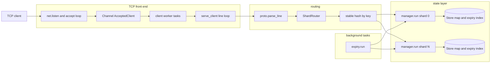
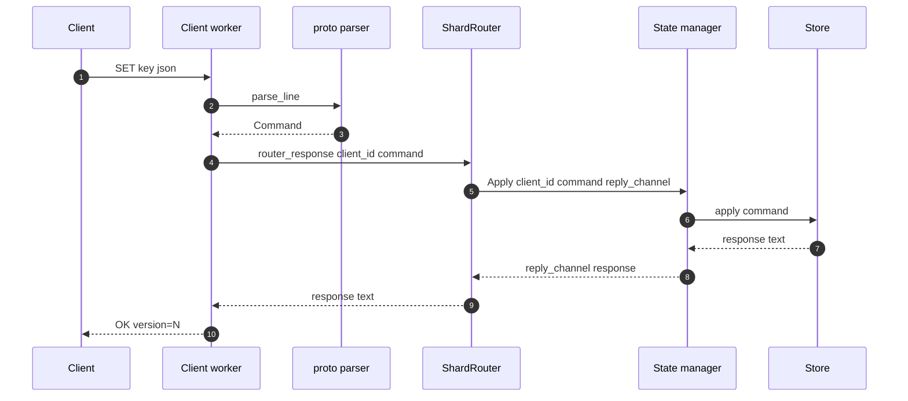
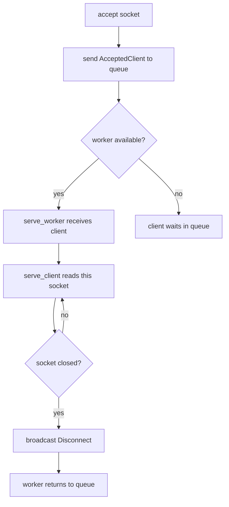
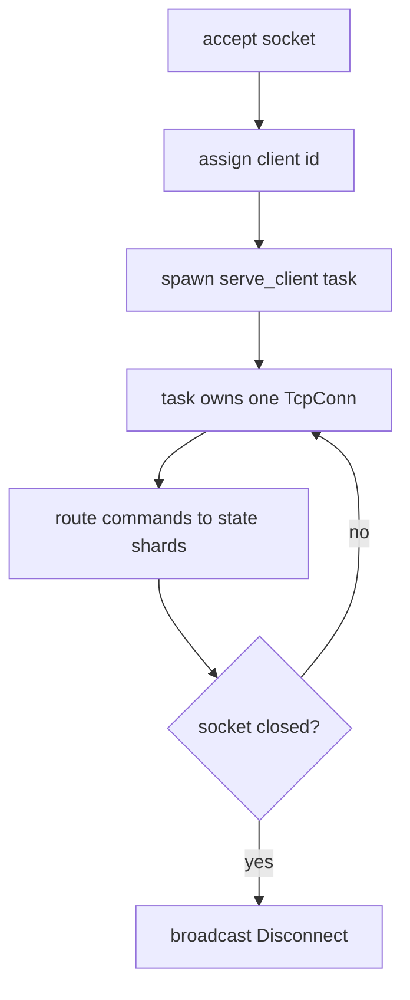
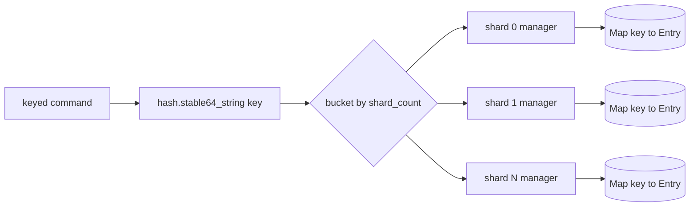
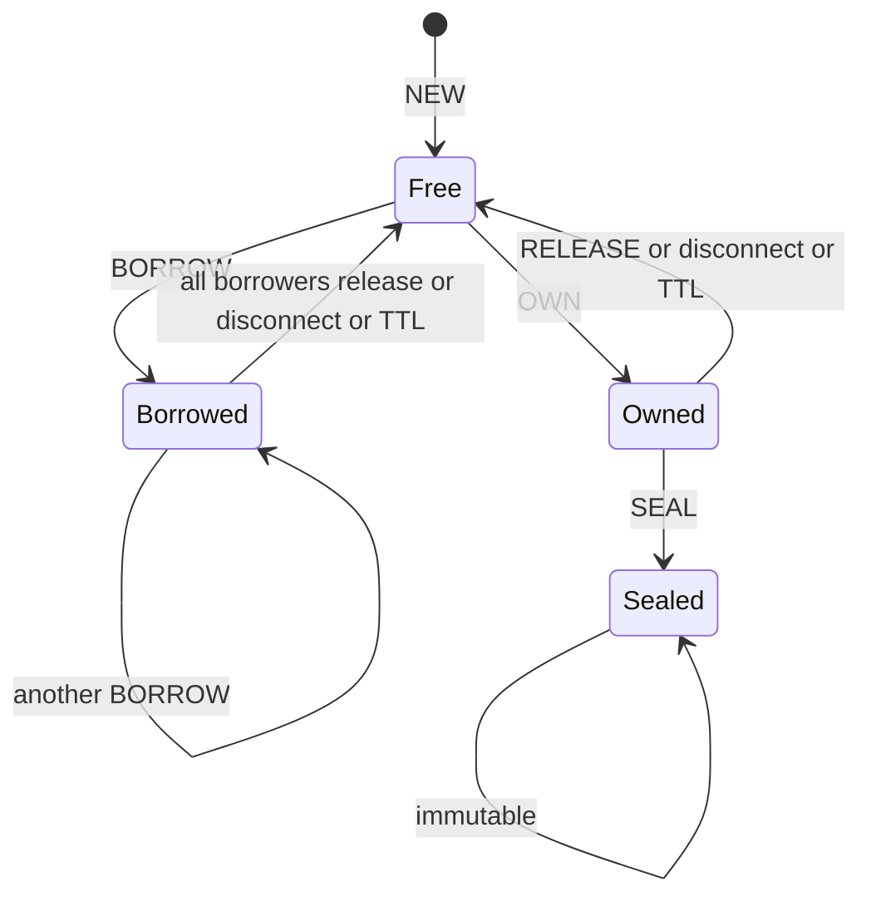
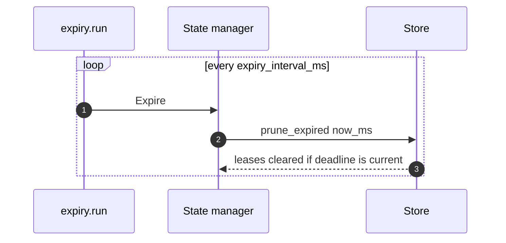

# surgekv Architecture

This document describes the current implementation, not only the intended
design. It is meant to keep the server model clear before we start heavier
load, memory, and deadlock checks.

## Short Answer: Clients and Workers

Multiple clients can connect to one `surgekv` instance.

The current caveat is the client worker model:

- `--workers` means "maximum number of active client connections served at the
  same time" in the current implementation.
- The default is `8`, so the default server can serve up to eight long-lived
  client TCP sessions concurrently.
- With `--workers 1`, one long-lived client occupies the only client worker.
  Further accepted clients wait in the accepted-client queue until that worker
  becomes free.
- State is still sharded separately with `--shards`; client workers and state
  shards are different layers.

This happens because `serve_worker` awaits `serve_client(...)` directly. A
worker returns to the accepted-client queue only after the current socket closes.

The target model is to spawn a dedicated task per accepted connection, while
keeping state managers as the serialization point for each shard. See
[Target Connection Model](#target-connection-model).

## Component Map



## Code Map

| Area | Files | Responsibility |
| --- | --- | --- |
| Entrypoint and config | `main.sg`, `config/*` | Parse CLI flags and start `server.serve`. |
| TCP server | `server/serve.sg`, `server/line.sg`, `server/ids.sg` | Accept sockets, assign client ids, read request lines, write response lines. |
| Routing | `server/shards.sg` | Route keyed commands to one state shard; fan out global commands. |
| Protocol | `proto/*` | Parse text commands and format text responses. |
| State managers | `manager/*` | Own shard request channels and run one task per state shard. |
| KV state | `state/*` | Store entries, ownership, borrows, versions, seal state, and expiry index. |
| Expiry | `expiry/run.sg` | Periodically ask all state managers to prune expired leases. |

## Request Flow



Every command is executed as a text request and text response. The state manager
does not expose shared mutable state to the TCP layer; it receives messages
through a channel and replies through a per-request reply channel.

## Current Connection Model



Operational consequences:

- Concurrent long-lived clients are bounded by `--workers`.
- `--client-queue` only buffers accepted clients. It does not make a single
  worker multiplex multiple active sockets.
- A smoke test that keeps one owner connection open and opens a second
  connection must run with at least `--workers 2`.
- This is acceptable for the current small smoke tests, but it is not the
  connection model we want before serious load testing.

## Target Connection Model

The intended server shape is accept-and-spawn:



In this model, the number of simultaneous client connections is no longer tied
to `--workers`. The limiting factors become file descriptors, memory per
connection, state shard throughput, and any explicit connection limit we add.

A careful implementation still needs structured task ownership:

- Keep handles for spawned client tasks so shutdown can cancel and await them.
- Add a bounded connection limit if we do not want unbounded task growth.
- Decide whether `--workers` remains as a compatibility flag, becomes an
  acceptor count, or is replaced with `--max-clients`.

## State Sharding Model



Each state manager owns one `Store`:

```text
Store {
    entries: Map<string, Entry>,
    expiry_index: ExpiryRecord[],
    test_now_ms: int64?,
}
```

The shard manager is the only task that mutates its `Store`. This gives us a
simple actor-style concurrency model:

- Commands for the same shard are serialized.
- Commands for different shards can progress independently.
- A single key is always handled by one shard because routing is based on the
  stable hash of the key.

Global commands are handled specially:

- `WHOAMI` asks all shards for hold counts and sums them.
- `KEYS` asks all shards for matching keys, merges, and sorts the result.
- `DISCONNECT` broadcasts to all shards so every owned or borrowed key held by
  that client is released.

## Entry State



`Entry` stores:

- raw JSON text as `value`
- optional exclusive `owner`
- zero or more `borrowers`
- permanent `sealed` flag
- lease TTL and monotonic deadline
- monotonic `version`, starting at `1`

Write rules:

- Free keys accept `SET`, `SET ... IF`, and `DEL`.
- The current owner can write an owned key.
- Any other writer receives `LOCKED`.
- Borrowed keys reject writes with `LOCKED`.
- Sealed keys reject mutation with `SEALED`.

## Expiry Model



TTL renewals append a new `ExpiryRecord`. Old records can remain in
`expiry_index` briefly. During pruning, a record only clears a lease when its
deadline still matches the entry's current `lease_deadline_ms`; stale records
are dropped.

This avoids scanning every key on every tick. The cost is proportional to the
number of pending expiry records in the shard.

## Bottlenecks and Guarantees

| Layer | Current behavior | Notes |
| --- | --- | --- |
| TCP accept | One accept loop | Accepts sockets and enqueues `AcceptedClient`. |
| Client serving | Up to `--workers` active sockets | Current limitation for long-lived clients. |
| State mutation | One manager task per shard | Intentional serialization point. |
| Same key writes | Serialized by one shard | Required for ownership and version correctness. |
| Different key writes | Parallel across shards | Depends on key distribution and shard count. |
| Expiry | One periodic background task | Sends non-blocking expire messages to shards. |
| Disconnect cleanup | Full scan per shard | Acceptable for v1; reverse index is a future optimization. |

## Next Architecture Fix

Before load testing, the highest-value architecture fix is the connection
serving model:

1. Replace "worker owns socket until close" with "accept loop or supervisor
   spawns a client task per accepted socket".
2. Track active client tasks for shutdown.
3. Add an explicit connection limit if needed.
4. Keep state managers unchanged; they are already the right serialization
   boundary for correctness.

After that, load tests should measure:

- many idle clients
- many clients issuing commands against different shards
- hot-key contention
- reconnect/disconnect cleanup under load
- TTL churn and stale expiry record cleanup
