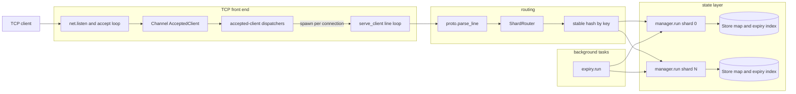
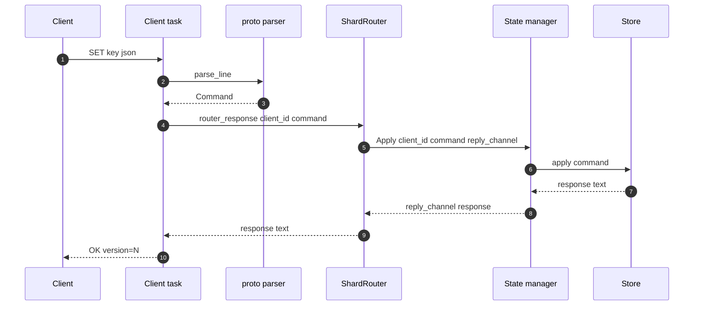
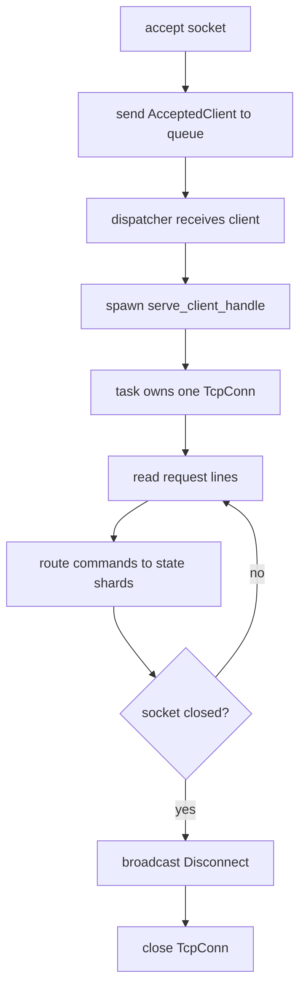
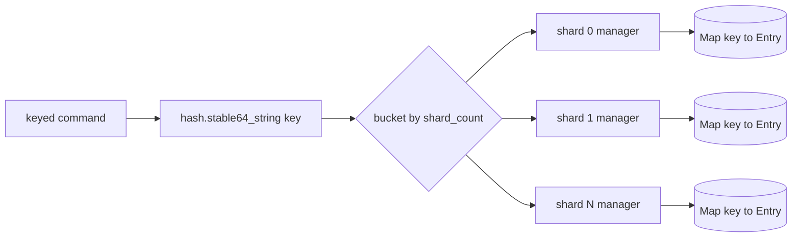
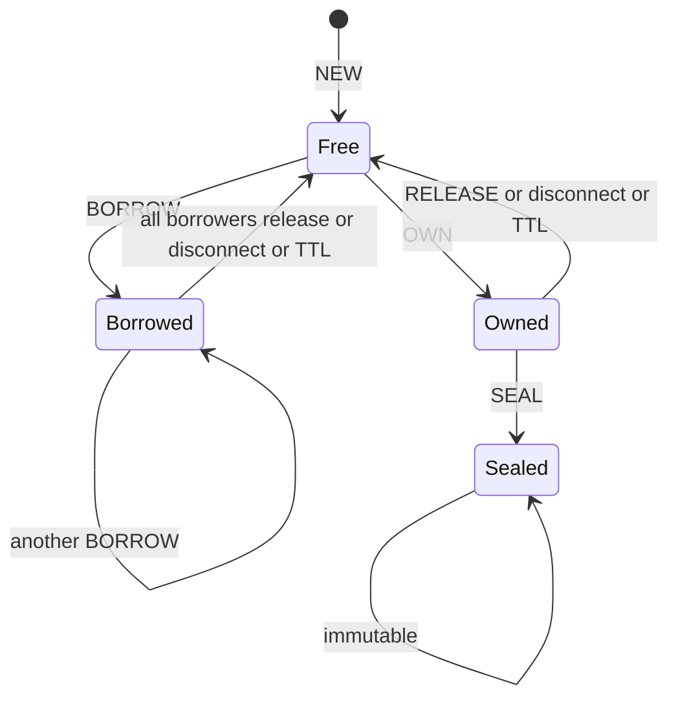
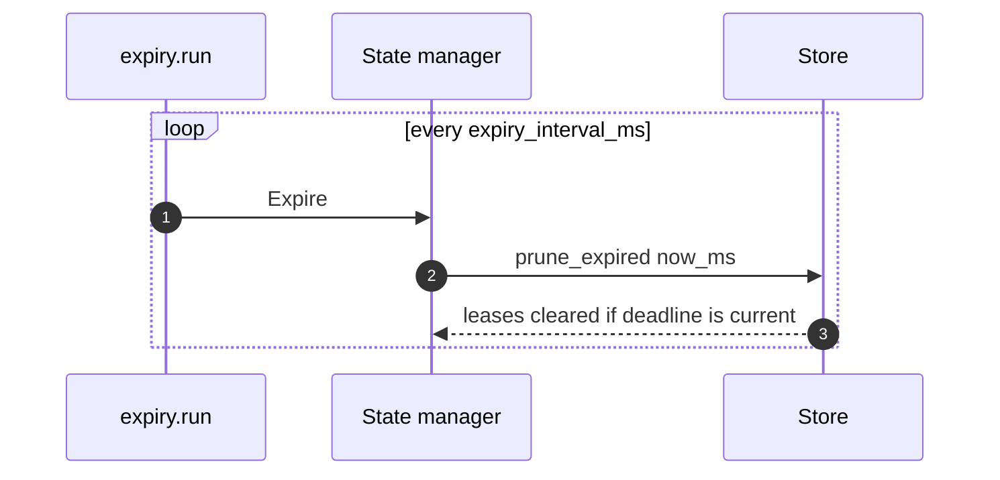

# surgekv Architecture

This document describes the current implementation, not only the intended
design. It is meant to keep the server model clear before we start heavier
load, memory, and deadlock checks.

## Short Answer: Clients and Workers

Multiple clients can connect to one `surgekv` instance.

`--workers` is the accepted-client dispatcher count. Dispatchers receive
accepted sockets from the queue and spawn a dedicated `serve_client` task for
each connection. A long-lived idle TCP session therefore does not occupy the
dispatcher, and a single server instance can serve multiple active clients even
with `--workers 1`.

State is sharded separately with `--shards`; dispatcher workers, client
connection tasks, and state shards are different layers.

There is no explicit active-client limit yet. The practical limits are file
descriptors, memory per connection task, state shard throughput, and the host
runtime.

## Component Map



## Code Map

| Area | Files | Responsibility |
| --- | --- | --- |
| Entrypoint and config | `main.sg`, `config/*` | Parse CLI flags and start `server.serve`. |
| TCP server | `server/serve.sg`, `server/line.sg`, `server/ids.sg` | Accept sockets, assign client ids, read request lines, write response lines. |
| Routing | `server/shards.sg` | Route keyed commands to one state shard; fan out global commands. |
| Protocol | `proto/*` | Parse text commands and format text responses. |
| State managers | `manager/*` | Own shard request channels and run one task per state shard. |
| KV state | `state/*` | Store entries, ownership, borrows, versions, seal state, and expiry index. |
| Expiry | `expiry/run.sg` | Periodically ask all state managers to prune expired leases. |

## Request Flow



Every command is executed as a text request and text response. The state manager
does not expose shared mutable state to the TCP layer; it receives messages
through a channel and replies through a per-request reply channel.

## Connection Model



Operational consequences:

- Active long-lived clients are not bounded by `--workers`.
- `--workers` controls how many dispatcher tasks drain the accepted-client
  queue.
- `--client-queue` buffers accepted sockets before a dispatcher spawns their
  client tasks.
- Workers keep handles to spawned client tasks and cancel/await them during
  server shutdown.
- There is still no explicit `--max-clients` limit; that is a future hardening
  step before serious load testing.

## State Sharding Model



Each state manager owns one `Store`:

```text
Store {
    entries: Map<string, Entry>,
    expiry_index: ExpiryRecord[],
    test_now_ms: int64?,
}
```

The shard manager is the only task that mutates its `Store`. This gives us a
simple actor-style concurrency model:

- Commands for the same shard are serialized.
- Commands for different shards can progress independently.
- A single key is always handled by one shard because routing is based on the
  stable hash of the key.

Global commands are handled specially:

- `WHOAMI` asks all shards for hold counts and sums them.
- `KEYS` asks all shards for matching keys, merges, and sorts the result.
- `DISCONNECT` broadcasts to all shards so every owned or borrowed key held by
  that client is released.

## Entry State



`Entry` stores:

- raw JSON text as `value`
- optional exclusive `owner`
- zero or more `borrowers`
- permanent `sealed` flag
- lease TTL and monotonic deadline
- monotonic `version`, starting at `1`

Write rules:

- Free keys accept `SET`, `SET ... IF`, and `DEL`.
- The current owner can write an owned key.
- Any other writer receives `LOCKED`.
- Borrowed keys reject writes with `LOCKED`.
- Sealed keys reject mutation with `SEALED`.

## Expiry Model



TTL renewals append a new `ExpiryRecord`. Old records can remain in
`expiry_index` briefly. During pruning, a record only clears a lease when its
deadline still matches the entry's current `lease_deadline_ms`; stale records
are dropped.

This avoids scanning every key on every tick. The cost is proportional to the
number of pending expiry records in the shard.

## Bottlenecks and Guarantees

| Layer | Current behavior | Notes |
| --- | --- | --- |
| TCP accept | One accept loop | Accepts sockets and enqueues `AcceptedClient`. |
| Client serving | One task per active socket | Long-lived clients do not occupy dispatchers. |
| State mutation | One manager task per shard | Intentional serialization point. |
| Same key writes | Serialized by one shard | Required for ownership and version correctness. |
| Different key writes | Parallel across shards | Depends on key distribution and shard count. |
| Expiry | One periodic background task | Sends non-blocking expire messages to shards. |
| Disconnect cleanup | Full scan per shard | Acceptable for v1; reverse index is a future optimization. |

## Next Hardening Work

Before serious load testing, the highest-value hardening work is:

1. Add an explicit connection limit if needed.
2. Add completed-client task pruning if churn makes task-handle retention too
   costly before shutdown.
3. Keep state managers unchanged; they are already the right serialization
   boundary for correctness.
4. Add a reverse client-to-key index if disconnect cleanup becomes too costly.

After that, load tests should measure:

- many idle clients
- many clients issuing commands against different shards
- hot-key contention
- reconnect/disconnect cleanup under load
- TTL churn and stale expiry record cleanup
